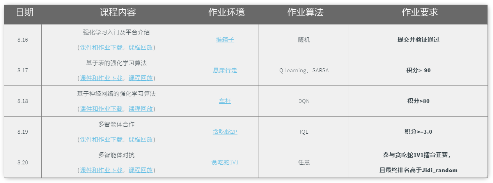

# SummerCourse2021

## 更新时间：20210820_1830
(持续更新中~敬请期待~)

一起来学习吧^0^

小编把每天的课程独立在一个文件夹里面，学习内容递进，完成所有五次作业的学员还将获得电子版结课证书！筒子们冲啊！

[comment]: <> (日期	课程内容	作业环境	作业算法	作业要求)

[comment]: <> (8.16	强化学习入门及平台介绍	推箱子	随机	提交并验证通过)

[comment]: <> (8.17	基于表的强化学习算法	悬崖漫步	Q-learning  SARSA	成绩优于随机10%)

[comment]: <> (8.18	基于神经网络的强化学习算法	车杆	DQN	成绩优于随机10%)

[comment]: <> (8.19	多智能体合作	贪吃蛇5P	IQL	成绩优于随机10%)

[comment]: <> (8.20	多智能体对抗	贪吃蛇1V1	任意	参与贪吃蛇1V1擂台  成绩优于随机10%)

课程表👇

---
### Env Dependency

>conda create -n jidi python=3.7.5

>conda activate jidi

>pip install -r requirements.txt

