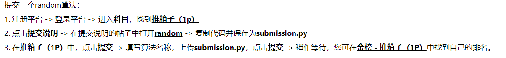

# 习题课第一天

## 任务：环境推箱子 - random策略 - 提交到Jidi平台

---
## Env 👉请看 [sokoban.py](env/sokoban.py)

## Random 👉请看 [random.py](examples/random.py)

## 提交 👉请看 [submission.py](examples/submission.py)

---
Have a good time~~~